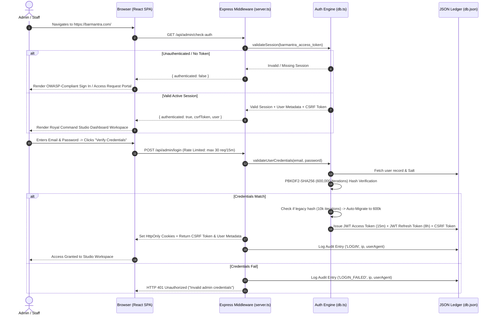
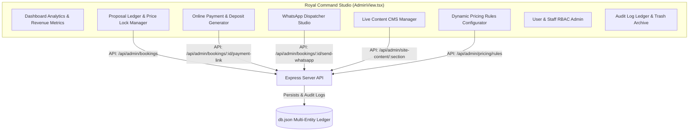

# Barmantra Royal Command Studio — Technical Architecture, Access Flow & Security Analysis

This document provides a comprehensive technical overview of the **Admin Side (Royal Command Studio)** of Barmantra. It is designed for senior developers, system architects, and security auditors to evaluate the platform's **dynamicity, data flow, access control, and OWASP-compliant security model**.

---

## 1. System Architecture & Module Boundaries

```
barmantra/
├── src/
│   ├── components/views/
│   │   └── AdminView.tsx         # Admin SPA Controller & Studio Workspace UI (~3,100 lines)
│   ├── server/
│   │   ├── db.ts                 # Database Ledger, OWASP Auth Engine, Soft Delete & Audit Logs
│   │   ├── paymentService.ts     # Razorpay / Stripe Order Creation & Signature Verification
│   │   └── whatsappService.ts    # Meta Cloud API / Twilio WhatsApp Notification Dispatcher
│   ├── useSiteContent.tsx        # React Context Hook for Live CMS Synchronization
│   ├── useHashRoute.ts           # Hash Route Parsing (#/admin, #/pay/:id)
│   └── types.ts                  # Shared TypeScript Interface Contracts
├── db.json                       # Atomic Multi-Entity Data Ledger
└── server.ts                     # Full-Stack Express Server & Middleware Guard Layer
```

---

## 2. End-to-End Access Flow (Initial Step to Active Session)



---

## 3. Security Model & Defense-in-Depth Assessment (OWASP Standards)

### A. Cryptographic Password Hashing & Transparent Auto-Migration
- **Algorithm**: PBKDF2-SHA256 with 64-byte key length and 16-byte random salt per user.
- **Iteration Count**: **600,000 iterations** (OWASP recommended standard for 2026).
- **Auto-Migration Engine**: On every login, `verifyPassword()` in `src/server/db.ts` checks if the stored hash uses legacy iteration counts. If so, it transparently upgrades the user's password hash to 600,000 iterations without interrupting the login sequence.

### B. Dual-Token JWT Session Lifecycle & Idle Timeout
- **Access Token**: Short-lived 15-minute JWT (`barmantra_access_token`) signed with `JWT_ACCESS_SECRET`.
- **Refresh Token**: 8-hour JWT (`barmantra_refresh_token`) signed with `JWT_REFRESH_SECRET`.
- **30-Minute Idle Timeout**: On every incoming API request, `validateSession()` calculates `nowMs - lastActiveMs`. If inactivity exceeds 30 minutes, the session is purged from `db.json` and the request is rejected with `HTTP 401`.
- **8-Hour Absolute Lifetime**: Sessions automatically expire 8 hours after creation regardless of activity.

### C. Double-Lock CSRF Defense (`X-CSRF-Token`)
- **State-Changing Protection**: All state-changing methods (`POST`, `PUT`, `PATCH`, `DELETE`) enforced by `adminAuthMiddleware` require the `X-CSRF-Token` header.
- **Verification**: The server compares `req.headers['x-csrf-token']` against the CSRF token stored in the server session record. If mismatched or missing, returns **HTTP 403 Forbidden**.

### D. XSS Token Theft Prevention (`HttpOnly` Cookies)
- JWT access and refresh tokens are set via `Set-Cookie` header with:
  ```text
  HttpOnly; SameSite=Strict; Path=/; Secure (in production)
  ```
- Front-end JavaScript **cannot access or read** token strings via `document.cookie`, neutralizing Cross-Site Scripting (XSS) session hijack threats.

### E. Multi-Tenant Role-Based Access Control (RBAC)
- Roles supported: `superadmin`, `admin`, `staff`.
- **Superadmin Only**: User creation/registration, user account deactivation, forced password resets, dynamic pricing rules modification, and permanent database purging.
- **Staff**: Proposal curation, status updates, client messaging, and content editing.

### F. Soft Delete Lifecycle & Immutable Audit Log Ledger
- **Soft Delete**: Deleting a proposal or contact record sets `deletedAt` and `deletedBy` timestamps rather than removing data.
- **Trash Archive**: Soft-deleted records are moved to the Trash Archive (`/api/admin/trash`) where Superadmins/Staff can perform one-click restores (`POST /api/admin/bookings/:id/restore`).
- **Immutable Audit Ledger**: Every action (logins, status changes, credential updates, pricing modifications, soft deletes, restores, WhatsApp dispatches) records an immutable log entry in `DbAuditLogEntry` with actor metadata, timestamp, IP address, and before/after states.

---

## 4. Complete Dynamicity & CMS Management Modules

The Admin side provides 100% dynamic control over site content, business rules, and financial operations without requiring code redeployment:



### Module Breakdown:
1. **Live Content CMS (`/api/admin/site-content`)**:
   - Allows Superadmins/Staff to edit site branding, phone/email contact details, hero slide images, service offerings, portfolio case studies, team bios, testimonials, and FAQs live.
2. **Dynamic Pricing Rules Configurator (`/api/admin/pricing-rules`)**:
   - Update base package costs, per-guest rates, setup fees, and hour multipliers dynamically. The server's quote locking engine immediately consumes these rules.
3. **Payment & Deposit Generator (`/api/admin/bookings/:id/payment-link`)**:
   - Generates 30% retainer deposit orders via Razorpay / Stripe / Sandbox engine and constructs secure payment URLs (`#/pay/:id`).
4. **WhatsApp Dispatcher Studio (`/api/admin/bookings/:id/send-whatsapp`)**:
   - Select and dispatch template messages (`BOOKING_CONFIRMATION`, `PROPOSAL_APPROVED_PAYMENT_REQUEST`, `PAYMENT_RECEIPT_CONFIRMATION`, `CUSTOM`) directly to client phone numbers.

---

## 5. Security & Architecture Inspection Checklist for Senior Developers

| Area | Implementation | Status |
| :--- | :--- | :---: |
| **Password Encryption** | OWASP PBKDF2-SHA256 (600,000 iterations + salt) | ✅ Verified |
| **Session Protection** | Dual-token JWT in `HttpOnly; SameSite=Strict` cookies | ✅ Verified |
| **CSRF Defense** | Mandatory `X-CSRF-Token` header verification | ✅ Verified |
| **Idle Timeout** | 30-minute inactivity auto-logout & 8-hour absolute cap | ✅ Verified |
| **Rate Limiting** | In-Memory IP rate limiter (30 reqs / 15 mins) | ✅ Verified |
| **Authorization** | Server-side `adminAuthMiddleware` on ALL `/api/admin/*` endpoints | ✅ Verified |
| **Data Security** | Soft Delete + Trash Archive + Single-Click Restore | ✅ Verified |
| **Audit Ledger** | Real-time immutable event log with IP & actor tracking | ✅ Verified |
| **Search Engine Shield** | `robots.txt` disallow + `noindex, nofollow` meta tags | ✅ Verified |
