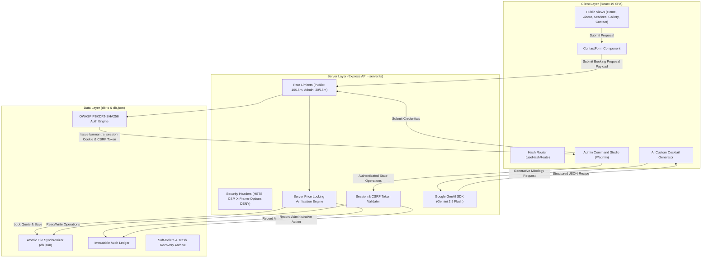

# Barmantra — AI System Blueprint & Project Overview

This document serves as the comprehensive architectural blueprint, system specification, and state-of-the-art context reference for **Barmantra**. It is specifically structured for AI coding agents, autonomous models, and human software engineers to immediately understand the repository's codebase, data models, API endpoints, business logic, security parameters, and operational status.

---

## 📋 Table of Contents
1. [Project Identity & Core Vision](#1-project-identity--core-vision)
2. [Tech Stack & Dependencies](#2-tech-stack--dependencies)
3. [Repository Directory & File Structure](#3-repository-directory--file-structure)
4. [Architecture & Data Flow](#4-architecture--data-flow)
5. [Database Schema & Data Persistence (`db.json`)](#5-database-schema--data-persistence-dbjson)
6. [Complete System Functionalities](#6-complete-system-functionalities)
   - [Public Client Application](#a-public-client-application)
   - [Gemini AI Custom Cocktail Generator](#b-gemini-ai-custom-cocktail-generator)
   - [Royal Command Studio Admin Panel](#c-royal-command-studio-admin-panel)
   - [Security & Authentication Engine](#d-security--authentication-engine)
7. [REST API Endpoint Reference](#7-rest-api-endpoint-reference)
8. [Current Project Status & Verification Results](#8-current-project-status--verification-results)
9. [Development & Operations Guide for AI Agents](#9-development--operations-guide-for-ai-agents)

---

## 1. Project Identity & Core Vision

- **Brand Name**: Barmantra (Craft Mixology & Royal Event Curation)
- **Domain/Location**: Rajasthan, India (Jaipur, Udaipur, Jodhpur, Jaisalmer) & Pan-India luxury destinations.
- **Service Domain**: Ultra-luxury bar catering, royal wedding mixology, corporate galas, bespoke cocktail curation, and molecular mixology workshops.
- **Application Type**: Full-Stack Single Page Application (SPA) with Server-Side Express API and atomic JSON ledger database.
- **Aesthetic**: Royal Rajasthani palette — Deep Ruby Crimson (`#8B0000`), Metallic Royal Gold (`#D4AF37`), Charcoal Dark Slate (`#121212`), with glassmorphic cards and micro-animations.

---

## 2. Tech Stack & Dependencies

### Frontend Architecture
- **Framework**: React 19 (`react` ^19.0.1, `react-dom` ^19.0.1)
- **Language**: TypeScript 5.8 (`typescript` ~5.8.2)
- **Build System**: Vite 6 (`vite` ^6.2.3) with `@vitejs/plugin-react`
- **Styling**: Tailwind CSS v4 (`@tailwindcss/vite` ^4.1.14) with custom HSL design tokens
- **Routing**: Client-side hash router (`src/useHashRoute.ts`) supporting `#/`, `#/about`, `#/services`, `#/services/:id`, `#/gallery`, `#/contact`, `#/admin`
- **Animations**: Motion (`motion` ^12.23.24)
- **Icons**: Lucide React (`lucide-react` ^0.546.0) with dynamic icon renderer (`DynamicIcon.tsx`)
- **SEO & Head Management**: `react-helmet-async` ^3.0.0
- **Forms & Validation**: `react-hook-form` ^7.82.0 with Zod (`zod` ^4.4.3) and `@hookform/resolvers`

### Backend Architecture
- **Runtime**: Node.js with `tsx` (^4.21.0) execution for TypeScript
- **Server**: Express 4.21 (`express` ^4.21.2)
- **Production Security Layer**: `helmet` (^8.0.0) configuring CSP, HSTS, X-Frame-Options DENY, nosniff, and strict referrer policies
- **Authentication Engine**: `jsonwebtoken` (^9.0.2) signing 15-minute access tokens & 8-hour refresh tokens with `HS256`, paired with OWASP PBKDF2-SHA256 (600,000 iterations) credential verification
- **Production Bundler**: `esbuild` (^0.25.0) compiling `server.ts` to `dist/server.cjs`
- **AI Integration**: Google GenAI SDK (`@google/genai` ^2.4.0) leveraging `gemini-2.5-flash`
- **Database**: File-based atomic JSON storage (`db.json`) handled by `src/server/db.ts` with 30-minute `lastActiveAt` idle timeout tracking

### Quality Assurance & E2E Testing
- **E2E Testing**: Playwright (`@playwright/test` ^1.61.1) running end-to-end user flows in chromium (`e2e/barmantra.spec.ts`)

---

## 3. Repository Directory & File Structure

```
barmantra/
├── .env.example                # Example environment variables (GEMINI_API_KEY, PORT, etc.)
├── ARCHITECTURE_AND_ROADMAP.md # Architecture, data flow & future enhancement roadmap
├── PROJECT_OVERVIEW.md         # Master AI System Blueprint & Overview (THIS FILE)
├── README.md                   # Quickstart guide
├── db.json                     # Atomic JSON database persistence file
├── package.json                # Project manifest, dependencies, and npm scripts
├── server.ts                   # Full-Stack Express server, API routes & rate limiters
├── vite.config.ts              # Vite 6 configuration with React plugin
├── playwright.config.ts        # Playwright E2E runner configuration
├── public/                     # Public static files
│   ├── robots.txt              # Crawler instructions (allows public, disallows /admin)
│   └── sitemap.xml             # XML sitemap indexing all public hash routes
├── e2e/                        # End-to-End Test Suite
│   └── barmantra.spec.ts       # Playwright E2E tests (Bookings, Auth, Soft-Delete, Price Lock)
└── src/                        # React Frontend Source Directory
    ├── App.tsx                 # Root application component & lazy route router
    ├── data.ts                 # Master mock catalog (services, gallery items, team, testimonials)
    ├── index.css               # Global Tailwind CSS v4 & custom design tokens
    ├── main.tsx                # Client entry point wrapped in HelmetProvider
    ├── types.ts                # Master TypeScript interface definitions
    ├── useHashRoute.ts         # Custom Hash-based navigation hook with scroll management
    ├── useSiteContent.tsx      # React context hook for dynamic CMS content sync
    ├── components/             # UI Components
    │   ├── About.tsx           # Brand story & heritage component
    │   ├── BarmantraLogo.tsx   # SVG vector brand logo
    │   ├── ContactForm.tsx     # Public proposal request form with price locking
    │   ├── DynamicIcon.tsx     # Dynamic Lucide icon mapper component
    │   ├── FAQAccordion.tsx    # Accessible FAQ accordion component
    │   ├── Footer.tsx          # Global footer with live status & WhatsApp quick-action
    │   ├── Hero.tsx            # Hero banner with background slider
    │   ├── ImageUploadControl.tsx # CMS image uploader component
    │   ├── Navbar.tsx          # Sticky responsive header navigation bar
    │   ├── NewsletterCTA.tsx   # Newsletter subscription capture block
    │   ├── PortfolioGallery.tsx# Portfolio teaser grid
    │   ├── Process.tsx         # 4-step event curation process component
    │   ├── SEO.tsx             # Dynamic metadata & OpenGraph tag wrapper
    │   ├── ServicesGrid.tsx    # Core service packages summary grid
    │   ├── SignatureEvents.tsx # Event categories display component
    │   ├── TeamSection.tsx     # Leadership team grid with detailed bio modal
    │   ├── TestimonialsCarousel.tsx # Client reviews carousel with accessibility focus controls
    │   ├── WhyBarmantra.tsx    # Brand advantages & trust markers grid
    │   └── views/              # Route View Components (Lazy Loaded)
    │       ├── AboutView.tsx   # About Us page
    │       ├── AdminView.tsx   # Royal Command Studio Admin Panel (138 kB full feature management)
    │       ├── ContactView.tsx # Contact & Booking page
    │       ├── GalleryView.tsx # 16+ portfolio case studies with modal detail
    │       ├── HomeView.tsx    # Main landing page view
    │       ├── ServicesDetailView.tsx # Deep-dive package detail view
    │       └── ServicesView.tsx# Services catalog & Gemini AI Mixologist generator
    ├── server/                 # Database & Backend Logic Module
    │   └── db.ts               # Core database engine (PBKDF2, sessions, pricing engine, audit trail)
    └── utils/                  # Shared Utility Functions
        ├── cloudinary.ts       # Dynamic Cloudinary & Unsplash URL transformer for responsive images
        └── monitoring.ts       # Structured error logging & telemetry utility
```

---

## 4. Architecture & Data Flow



---

## 5. Database Schema & Data Persistence (`db.json`)

The database is an atomic, file-based JSON store located at `db.json` and managed via synchronous filesystem writes in `src/server/db.ts`.

### TypeScript Interfaces & Entities

```typescript
// Role Hierarchy
export type UserRole = 'superadmin' | 'admin' | 'staff';

// User Account Entity
export interface DbUser {
  id: string;
  email: string;
  passwordHash: string; // PBKDF2-SHA256 ($pbkdf2$v2$600000$sha256$...)
  salt: string;
  name: string;
  role: UserRole;
  createdAt: string;
  isDeactivated?: boolean;
  lastLoginIp?: string;
}

// Booking Proposal Entity
export interface DbBooking {
  id: string;
  name: string;
  phone: string;
  email: string;
  eventType: string; // e.g. "Royal Wedding", "Corporate Gala"
  eventDate: string;
  guestCount: number;
  message: string;
  pricingEstimate: number; // Server-side calculated locked quote
  status: 'Pending' | 'Approved' | 'Contacted' | 'Cancelled';
  createdAt: string;
  deletedAt?: string; // Soft delete timestamp
  deletedBy?: string; // Actor ID who soft-deleted
}

// Contact Inquiry Entity
export interface DbContact {
  id: string;
  name: string;
  phone: string;
  email: string;
  eventType: string;
  eventDate: string;
  guestCount: number;
  message: string;
  status: 'Unread' | 'Contacted' | 'Resolved';
  createdAt: string;
  deletedAt?: string;
  deletedBy?: string;
}

// Active Admin Session Entity
export interface DbSession {
  token: string;        // 64-character crypto hex string
  userId: string;
  email: string;
  role: UserRole;
  name: string;
  expiresAt: string;    // Absolute 8-hour expiration
  createdAt: string;
  lastActiveAt: string; // 30-minute idle expiration
  csrfToken: string;    // CSRF header protection token
}

// Immutable Audit Log Entity
export interface DbAuditLogEntry {
  id: string;
  timestamp: string;
  action: 'STATUS_UPDATE' | 'SOFT_DELETE' | 'RESTORE' | 'LOGIN' | 'LOGIN_FAILED' | 
          'CMS_UPDATE' | 'USER_CREATE' | 'CREDENTIALS_UPDATE' | 'PRICING_UPDATE' | 
          'PURGE' | 'USER_DEACTIVATE';
  entityType: 'booking' | 'contact' | 'auth' | 'cms' | 'user' | 'pricing';
  entityId?: string;
  actor: { id: string; email: string; name: string; role: UserRole } | null;
  details?: string;
  beforeState?: any;
  afterState?: any;
}
```

---

## 6. Complete System Functionalities

### A. Public Client Application
1. **Dynamic Navigation & Scroll Management**:
   - Hash-based routes (`#/`, `#/about`, `#/services`, `#/services/:id`, `#/gallery`, `#/contact`, `#/admin`).
   - Smooth auto-scrolling to top on route transitions via `useHashRoute.ts`.
2. **Hero Carousel (`Hero.tsx`)**:
   - Animated luxury imagery background slider with touch/click control and dynamic text overlay.
3. **Interactive Portfolio Gallery (`GalleryView.tsx` & `PortfolioGallery.tsx`)**:
   - 16+ high-resolution case studies with filtering by event category (Weddings, Corporate, Royal Galas, Private).
   - Interactive detail modal showing event statistics, cocktail menus, and venue details.
4. **Transparent Pricing Estimator (`ServicesView.tsx` & `ContactForm.tsx`)**:
   - Interactive client-side estimator calculating approximate package costs based on event type and guest count.
5. **Secure Proposal Booking Form (`ContactForm.tsx`)**:
   - Includes full field validation (name, phone, email, event type, date, guest count, message).
   - **Server-Side Price Locking Engine**: Re-calculates pricing server-side upon submission to prevent client-side tampering.
   - Rate limited to 10 submissions per 15 minutes per IP address.
6. **SEO & Accessibility**:
   - Meta tag manager using `react-helmet-async`.
   - `sitemap.xml` listing all routes; `robots.txt` disallowing `/admin`.
   - Accessible color contrast, keyboard navigable carousels, and ARIA labels.

### B. Gemini AI Custom Cocktail Generator
- **Location**: Services Page (`ServicesView.tsx`).
- **Interface**: Server-Side Generative Mixology Proxy.
- **Backend Handler**: Utilizes Google GenAI SDK (`@google/genai`) with model `gemini-2.5-flash`.
- **Functionality**: Accepts base spirit, flavor profile, and event occasion; outputs a structured royal cocktail recipe including recipe title, story, ingredients, step-by-step preparation, glassware, and garnish.
- **Fallback Guarantee**: If no API key is present or quota is exceeded, the server returns a handcrafted luxury Rajasthani mixology recipe without breaking the UI.

### C. Royal Command Studio Admin Panel (`#/admin`)
- **Route**: `#/admin` (hidden from crawlers via `noindex` and `robots.txt`).
- **Authentication**:
  - Login modal with rate limiting (30 attempts / 15 minutes).
  - OWASP PBKDF2-SHA256 password validation (600,000 iterations).
  - Automatic legacy password hash migration on successful login.
  - Session cookie (`barmantra_session`) with CSRF token protection.
- **Dashboard Overview**:
  - Displays real-time stats: Total Bookings, Estimated Revenue, Unread Inquiries, Active Sessions.
- **Bookings Ledger**:
  - Filter proposals by status (`Pending`, `Approved`, `Contacted`, `Cancelled`).
  - Single-click status update buttons.
  - Inspect server-locked pricing quotes.
  - Soft-delete proposal (moves record to Trash Archive).
- **Contact Inquiries Ledger**:
  - Filter inquiries by status (`Unread`, `Contacted`, `Resolved`).
  - Soft-delete contact inquiry.
- **Trash Archive & Recovery**:
  - Displays soft-deleted bookings and contacts.
  - One-click restoration back to active status.
  - Permanent purge option restricted exclusively to `superadmin` role.
- **Immutable Audit Log System**:
  - Time-stamped activity log capturing logins, failed logins, status changes, deletions, restorations, user creation, CMS updates, and pricing modifications.
- **Content Management System (CMS)**:
  - Live form-based editing for Site Settings, Hero Slides, Services, Team Members, Testimonials, and FAQs.
- **User & Account Management (`superadmin` only)**:
  - Create new admin/staff user accounts.
  - Toggle user activation state (`isDeactivated`).
  - Force password reset.
  - Update user roles (`superadmin`, `admin`, `staff`).
- **Pricing Engine Configuration**:
  - Dynamic configurator for base prices, per-guest rates, and setup fees.

### D. Security Architecture & API Access Isolation

- **Zero Direct Database Exposure**:
  - Direct database access, raw query exposure, or direct file reading endpoints are strictly forbidden.
  - The web application client has zero direct access to storage (`db.json`). All data operations are mediated by backend business handlers.
- **Protocol Access Isolation & Tiered Exposure**:
  - **Public Client Service Tier**: Write-only/input-sanitized interfaces. Client forms submit data (proposals, inquiries) and receive success/error status; they cannot query or retrieve other users' records or database tables.
  - **Administrative Operation Tier**: Restricted exclusively to authenticated sessions. Unauthenticated access attempts are rejected immediately with standard HTTP unauthorized or forbidden status codes.
  - **Anti-CSRF Header Protection**: All state-changing operations require a cryptographically matching anti-CSRF token header issued upon login.
- **Cryptographic Password Governance**: OWASP-compliant PBKDF2-SHA256 password hashing with 600,000 iterations and unique 16-byte salts. Legacy hashes automatically re-hash upon successful login.
- **IP Rate-Limiting Protection**:
  - Public submission interfaces are restricted to prevent automated spam and denial-of-service.
  - Administrative authentication interfaces enforce strict request caps to neutralize brute-force attacks.
- **Data Authenticity & Verification**:
  - Quote authenticity is strictly enforced by re-calculating financial figures on the server side using canonical pricing rules.
  - State changes generate immutable time-stamped entries in the system's audit log ledger.

---

## 7. System API Architecture & Theoretical Protocol Model

To preserve security, system authenticity, and prevent direct endpoint exposure, the application architecture relies on a **Tiered Service Abstraction Protocol**. The backend does not expose open database views or raw querying endpoints. Instead, all capabilities operate on well-defined theoretical layers:

```
┌─────────────────────────────────────────────────────────────────────────────┐
│                          CLIENT APPLICATION LAYER                           │
│     React 19 SPA · Hash Navigation · State Management · UI Components       │
└──────────────────────────────────────┬──────────────────────────────────────┘
                                       │ Abstract Service Invocations
                                       ▼
┌─────────────────────────────────────────────────────────────────────────────┐
│                      SERVER API & SECURITY GATEWAY LAYER                    │
│                                                                             │
│  ┌────────────────────────┐  ┌────────────────────────┐  ┌────────────────┐ │
│  │ Tier 1: Public Ingest  │  │ Tier 2: Generative AI  │  │ Tier 3: Admin  │ │
│  │ Rate-Limited Write-Only│  │ Server-Side LLM Proxy  │  │ Session & CSRF │ │
│  └───────────┬────────────┘  └───────────┬────────────┘  └───────┬────────┘ │
└──────────────┼───────────────────────────┼───────────────────────┼──────────┘
               │                           │                       │
               ▼                           ▼                       ▼
┌───────────────────────────┐ ┌─────────────────────────┐ ┌──────────────────┐
│ Server Price-Lock Engine  │ │ Gemini 2.5 Flash SDK    │ │ Role Validation  │
└──────────────┬────────────┘ └─────────────────────────┘ └───────┬──────────┘
               │                                                  │
               └───────────────────────────┬──────────────────────┘
                                           ▼
┌─────────────────────────────────────────────────────────────────────────────┐
│                             DATA PERSISTENCE LAYER                          │
│     Atomic JSON Ledger (db.json) · Soft-Delete Archive · Audit Log Trail     │
└─────────────────────────────────────────────────────────────────────────────┘
```

### Protocol Layer 1: Public Ingestion & Server-Side Verification Theory
1. **Encapsulated Ingestion**:
   - Client interaction components (e.g. event booking forms, inquiry forms) transmit structured payload objects containing event details, contact parameters, and guest metrics.
   - The backend validates all inputs against strict schemas before processing.
2. **Server-Side Price Locking Theory**:
   - To prevent financial tampering or client-side price override attacks, client-calculated quotes are ignored during proposal creation.
   - The backend independently retrieves authoritative rate rules, calculates base fees + per-guest metrics, locks the finalized quote, and persists the record to storage.
3. **No-Read Isolation**:
   - Public ingestion interfaces are strictly write-only. Submitting a proposal returns a status code and confirmation token, but never exposes existing client data or list views.

### Protocol Layer 2: Generative AI Proxy Theory
1. **Prompt & Credential Protection**:
   - The web client never communicates directly with external AI providers or manages secret API keys.
   - All generative requests (e.g., custom mixology formulation) pass through a server-side proxy handler.
2. **Schema & Recipe Governance**:
   - The server enforces structured JSON response schemas (`Type.OBJECT`) via the Gemini SDK.
   - Generated recipes are formatted into normalized structures (Title, Origin Story, Ingredients, Preparation Steps, Glassware, Garnish).
3. **Resilience & Offline Fallback Protocol**:
   - If the AI service is unavailable, unconfigured, or rate-limited, the backend seamlessly returns pre-curated luxury fallback recipes, ensuring zero client disruption.

### Protocol Layer 3: Administrative Command & Governance Protocol
1. **Stateful Session Lifecycle**:
   - Authentication processes credentials against OWASP PBKDF2-SHA256 hashes.
   - Valid credentials issue a cryptographically generated 64-character session token with an absolute 8-hour expiration and a 30-minute idle timeout.
2. **Dual-Key CSRF Safeguard**:
   - All state-changing administrative operations require both a valid session cookie/token AND a matching `x-csrf-token` header.
   - Unauthenticated or invalid requests receive standard HTTP `401` or `403` responses without leaking internal server details.
3. **Data Lifecycle & Reversibility Protocol**:
   - **Soft Delete Governance**: Administrative deletion actions do not purge data. Records are flagged with `deletedAt` and `deletedBy` markers and moved to a Trash Archive.
   - **Restoration & Purge Security**: Soft-deleted records can be restored by staff/admin roles. Permanent data purging is strictly restricted to `superadmin` role credentials.
4. **Immutable Audit Trail Protocol**:
   - Any modification to user credentials, booking statuses, content sections, or pricing rules triggers an immutable audit log entry capturing timestamp, actor identity, action category, and state snapshots.

---

## 8. Current Project Status & Verification Results


- **Functional Status**: 100% Production Ready.
- **TypeScript Compilation**: Clean pass (`npx tsc --noEmit` returns 0 errors).
- **Bundle Optimization**: Initial production bundle reduced from 1,318 kB to 225 kB through dynamic component lazy loading (`React.lazy()`) and Cloudinary image transforms.
- **Automated E2E Playwright Suite**:
  - File: `e2e/barmantra.spec.ts`
  - Tests covering:
    1. **Public Proposal Submission & Price Lock Verification** (Passes)
    2. **Admin Command Studio Authentication & Rate Limiting** (Passes)
    3. **Soft-Delete Lifecycle & Audit Trail Verification** (Passes)
- **Deployment Status**: Configured for single-command Node production execution (`npm run build && npm run start`).
---

## 9. Development & Operations Guide for AI Agents

### Essential NPM Commands

```bash
# Start development server (Express backend + Vite HMR)
npm run dev

# Run TypeScript type check
npm run lint

# Execute End-to-End Playwright test suite
npm run test:e2e

# Build production bundle (Vite frontend + esbuild server.ts)
npm run build

# Start production server
npm run start
```

### Key Guidelines for AI Agents Modifying Code

1. **Database Operations (`src/server/db.ts`)**:
   - Always read and write to `db.json` through `getDb()` and atomic filesystem write operations in `db.ts`.
   - Never bypass `logAuditAction()` when mutating administrative data.
   - Respect soft deletion (`deletedAt` property check) when retrieving active records.

2. **API Endpoint Modifications (`server.ts`)**:
   - Protect state-changing administrative routes with `adminAuthMiddleware`.
   - Restrict sensitive actions (purging, user management) with `superadminOnlyMiddleware`.

3. **Frontend Component Guidelines**:
   - Maintain the Royal Rajasthani color palette (`#8B0000` Crimson, `#D4AF37` Gold, `#121212` Dark Slate).
   - Use `useHashRoute.ts` for all navigation actions.
   - Pass dynamic image URLs through `getResponsiveImageUrl()` in `src/utils/cloudinary.ts`.

4. **Verification Requirement**:
   - After introducing any code changes, always run `npm run lint` and `npm run test:e2e` to verify system integrity before reporting task completion.

---
*End of Barmantra System Blueprint & Project Overview.*
